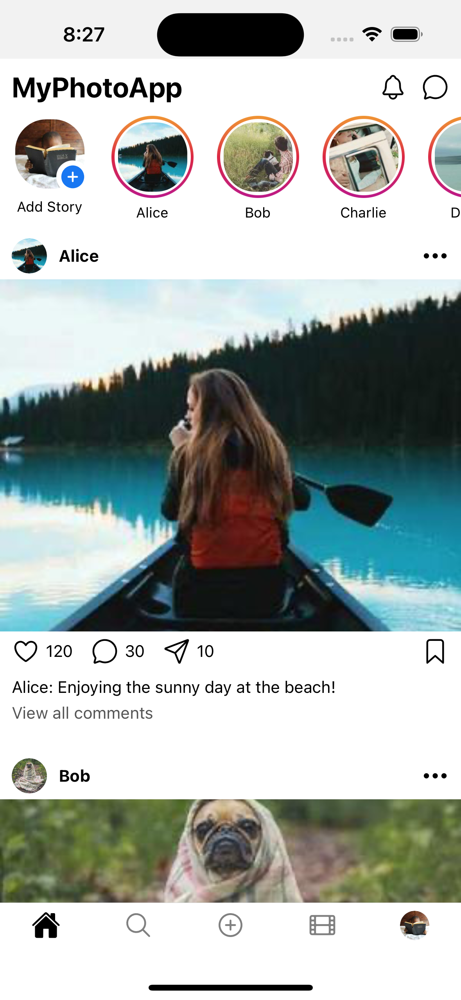
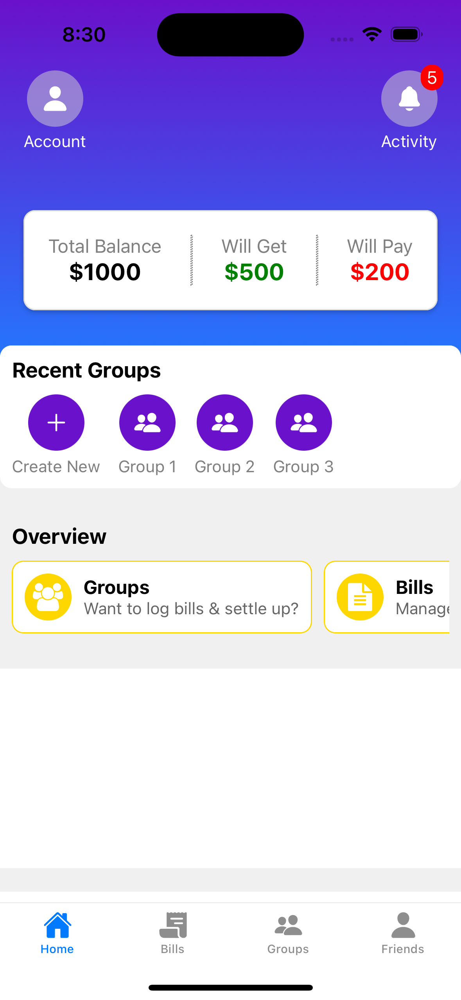

# React Native Projects

Welcome to my React Native Projects repository! This repository contains a collection of React Native projects that I've built with the help of GitHub Copilot. Each project showcases different features and functionalities of React Native, providing a comprehensive overview of what can be achieved with this powerful framework.

## Projects

Here are the projects included in this repository:

1. **MyMusic**: A modern music streaming platform featuring:
   - 🎵 Modern UI/UX inspired by popular music streaming apps
   - 🎧 Music player with controls
   - 📜 Playlist creation and management
   - 🌓 Light/Dark theme support
   - 🔍 Search functionality
   
   

2. **MyPhotoPlatform**: An Instagram-like social media platform featuring:
   - 📱 Modern UI/UX inspired by Instagram
   - 📝 Feed posts with interactions
   - 📸 Stories viewer and creation
   - 🎬 Reels player with interactions
   - 💬 Direct messaging interface
   
   

3. **NyarV3**: A modern expense management application featuring:
   - 📱 Modern UI/UX for managing expenses
   - 🏠 Home screen with balance overview
   - 👥 Groups management
   - 👤 Friends management
   - 💸 Bills and transactions tracking
   
   

Each project is built with React Native and Expo, featuring clean UI with both light and dark theme support. You can find detailed documentation, installation instructions, and usage guides in each project's respective directory:

- [mymusic](mymusic/README.md)
- [myPhotoPlatform](myPhotoPlatform/README.md)
- [nyar_v3](nyar_v3/README.md)

## Contributing

Contributions are welcome! If you have any improvements or new projects to add, please fork the repository and create a pull request. Make sure to follow the coding standards and include a detailed description of your changes.

## License

This repository is licensed under the MIT License. See the [LICENSE](LICENSE) file for more information.

---

Happy coding! 🚀