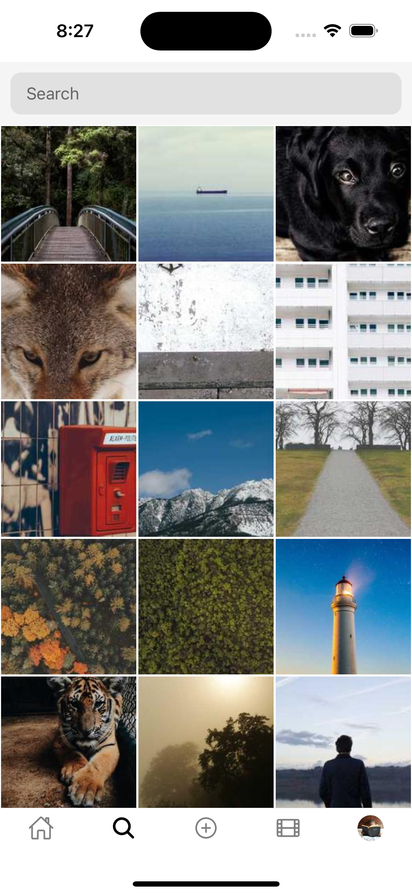
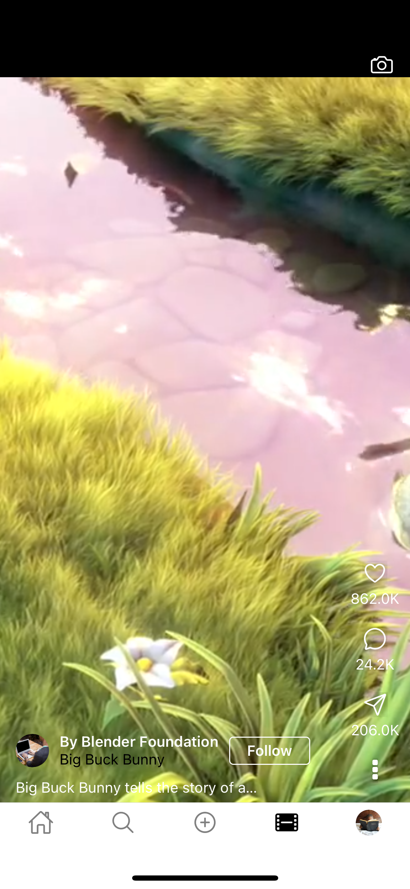
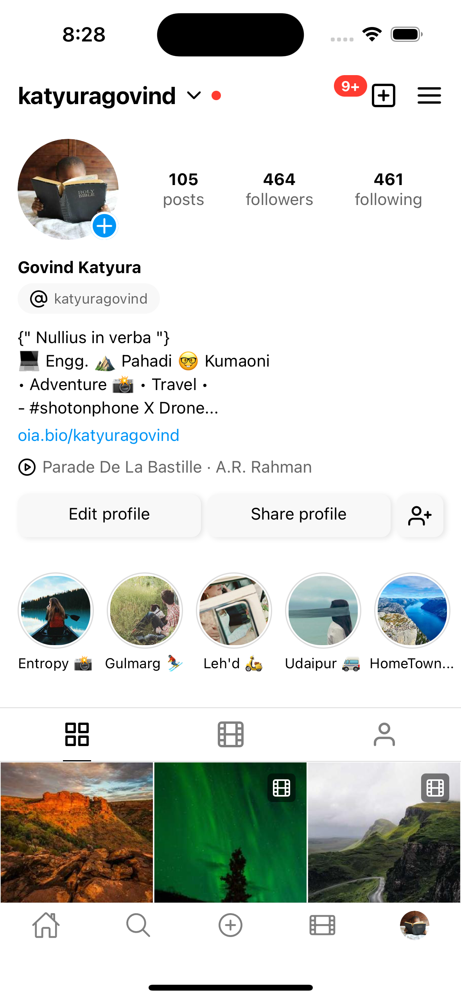

# MyPhotoPlatform

A modern Instagram clone built with React Native and Expo, featuring a clean UI with both light and dark theme support.

## 📱 Screenshots

<div style="display: flex; justify-content: space-between; margin-bottom: 20px;">
    
    
    <!--  -->
    
    
</div>

## ✨ Features

- 📱 Modern UI/UX inspired by Instagram
- 🌓 Light/Dark theme support
- 📝 Feed posts with interactions
- 📸 Stories viewer and creation
- 🎬 Reels player with interactions
- 🔍 Search functionality
- 👤 User profiles with customization
- 💬 Direct messaging interface

## 🚀 Technologies

- [React Native](https://reactnative.dev/)
- [Expo](https://expo.dev/)
- [React Navigation](https://reactnavigation.org/)
- [Expo Router](https://docs.expo.dev/router/introduction/)
- [React Native Reanimated](https://docs.swmansion.com/react-native-reanimated/)

## 🛠️ Installation

1. **Clone the repository**

```bash
git clone https://github.com/yourusername/MyPhotoPlatform.git
cd MyPhotoPlatform
```

2. **Install dependencies**

```bash
npm install
```

3. **Start the development server**

```bash
npm start
```

## 📱 Running the App

1. Install the Expo Go app on your iOS or Android device
2. Scan the QR code from your terminal using:
   - iOS: Camera app
   - Android: Expo Go app
3. Start exploring the app!

## 🧩 Project Structure

```
MyPhotoPlatform/
├── app/                    # Main application code
│   ├── screens/           # Screen components
│   ├── components/        # Reusable components
│   ├── context/          # React Context providers
│   └── data/             # Mock data and constants
├── assets/               # Images, fonts, etc.
└── package.json          # Project dependencies
```

## 🤝 Contributing

Contributions are welcome! Please feel free to submit a Pull Request.

## 📄 License

This project is licensed under the MIT License - see the [LICENSE](LICENSE) file for details.

## 👥 Author

Your Name - [@Govindskatyura](https://github.com/Govindskatyura)

---

<p align="center">Made with ❤️ using React Native & Expo</p>