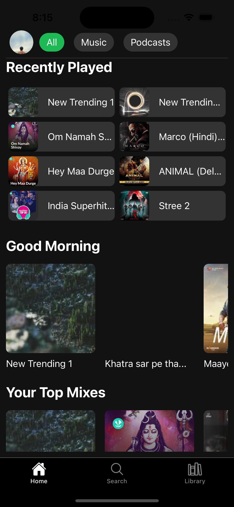
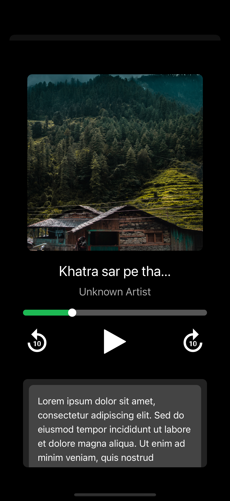
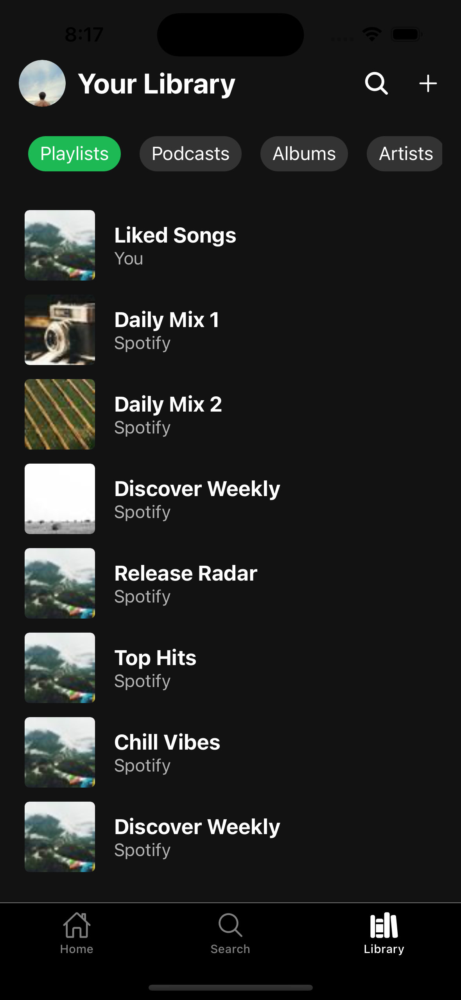
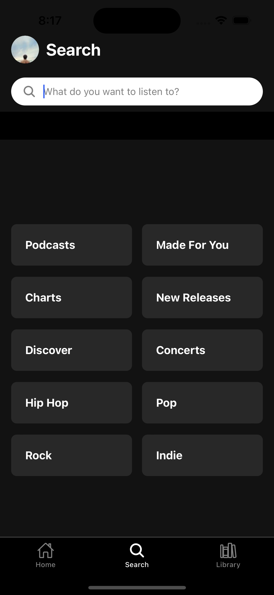
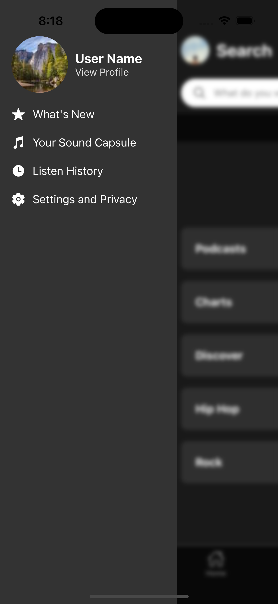

# MyMusic

A modern music streaming platform built with React Native and Expo, featuring a clean UI with both light and dark theme support.

## 📱 Screenshots

<div style="display: flex; justify-content: space-between; margin-bottom: 20px;">
    
    
    
    
    
</div>

## ✨ Features

- 🎵 Modern UI/UX inspired by popular music streaming apps
- 🌓 Light/Dark theme support
- 🎧 Music player with controls
- 📜 Playlist creation and management
- 🔍 Search functionality
- 👤 User profiles with customization

## 🚀 Technologies

- [React Native](https://reactnative.dev/)
- [Expo](https://expo.dev/)
- [React Navigation](https://reactnavigation.org/)
- [Expo Router](https://docs.expo.dev/router/introduction/)
- [React Native Reanimated](https://docs.swmansion.com/react-native-reanimated/)

## 🛠️ Installation

1. **Clone the repository**

```bash
git clone https://github.com/yourusername/MyMusic.git
cd MyMusic
```

2. **Install dependencies**

```bash
npm install
```

3. **Start the development server**

```bash
npx expo start
```

## 📱 Running the App

1. Install the Expo Go app on your iOS or Android device
2. Scan the QR code from your terminal using:
   - iOS: Camera app
   - Android: Expo Go app
3. Start exploring the app!

## 🧩 Project Structure

```
MyMusic/
├── app/                    # Main application code
│   ├── components/         # Reusable components
│   ├── context/            # React Context providers
│   ├── navigation/         # Navigation setup
│   ├── screens/            # Screen components
│   └── utils/              # Utility functions
├── assets/                 # Images, fonts, etc.
├── backend/                # Backend scripts and configurations
├── app-example/            # Example app code
├── App.js                  # Entry point for the app
├── package.json            # Project dependencies
└── README.md               # Project documentation
```

## 🤝 Contributing

Contributions are welcome! Please feel free to submit a Pull Request.

## 📄 License

This project is licensed under the MIT License - see the [LICENSE](LICENSE) file for details.

## 👥 Author

Your Name - [@Govindskatyura](https://github.com/Govindskatyura)

---

<p align="center">Made with ❤️ using React Native & Expo</p>