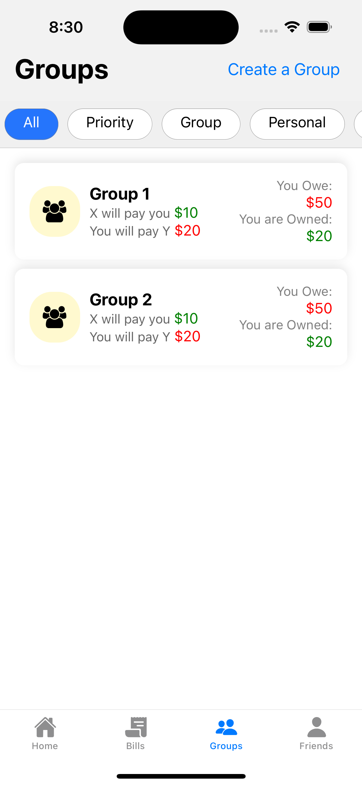
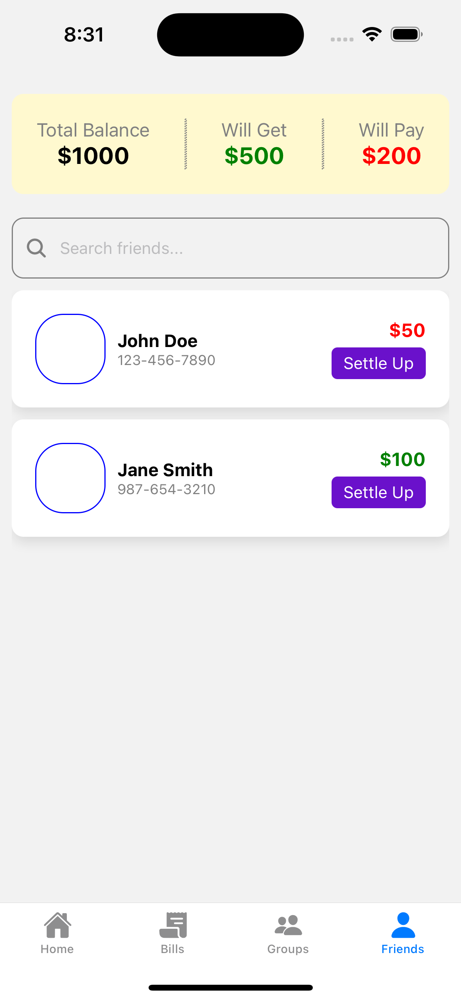
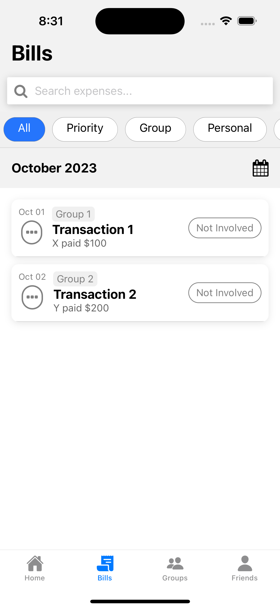
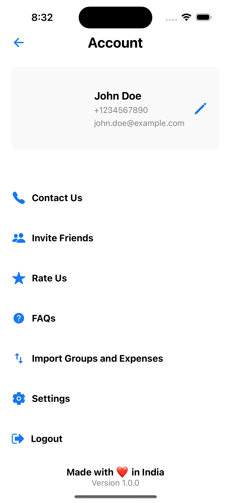

# NyarV3

A modern expense management app built with React Native and Expo, featuring a clean UI with both light and dark theme support.

## 📱 Screenshots

<div style="display: flex; justify-content: space-between; margin-bottom: 20px;">
    
    
    
    
    
</div>

## ✨ Features

- 📱 Modern UI/UX for managing expenses
- 🌓 Light/Dark theme support
- 🏠 Home screen with balance overview
- 👥 Groups management
- 👤 Friends management
- 💸 Bills and transactions tracking
- 🔍 Search functionality
- ⚙️ Account settings and customization

## 🚀 Technologies

- [React Native](https://reactnative.dev/)
- [Expo](https://expo.dev/)
- [React Navigation](https://reactnavigation.org/)
- [Expo Router](https://docs.expo.dev/router/introduction/)
- [React Native Reanimated](https://docs.swmansion.com/react-native-reanimated/)

## 🛠️ Installation

1. **Clone the repository**

```bash
git clone https://github.com/yourusername/NyarV3.git
cd NyarV3
```

2. **Install dependencies**

```bash
npm install
```

3. **Start the development server**

```bash
npm start
```

## 📖 Usage

1. **Open the app on your device or emulator**

2. **Navigate through the app to manage your expenses**

3. **Customize settings and preferences as needed**